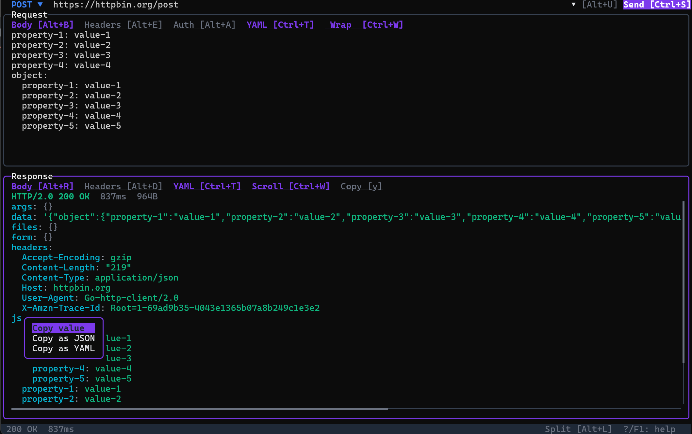

# REST Helper

A terminal-based REST API client built with Go and [Bubble Tea](https://github.com/charmbracelet/bubbletea).



## Features

- **URL bar** with method selector (GET, POST, PUT, PATCH, DELETE, HEAD, OPTIONS)
- **Request body** editor with JSON and YAML support, wrap/scroll modes (auto-converts YAML to JSON on send)
- **Request headers** editor with key-value pair input
- **Auth** tab with Bearer / Basic / Custom token support and visibility toggle
- **Response viewer** with syntax-highlighted JSON/YAML/RAW display, wrap/scroll modes, and horizontal scrolling
- **Right-click context menu** on response body to copy values as JSON/YAML (with subtree support)
- **Field picker** for copying individual JSON fields from the response
- **History window** with filtering, selection, batch delete, deduplication, and one-click restore
- **Split / Fullscreen layout** modes with adjustable panel sizes
- **Full keyboard and mouse support** including clickable tabs, scrollbar dragging, and mouse wheel
- **Persistent storage** via SQLite (pure Go, no CGo required) — history, settings, and UI preferences are saved
- **Minimum terminal size**: 80x24

## Installation

Download the binary for your platform from [GitHub Releases](https://github.com/kariya-mitsuru/rest-helper/releases) and place it in a directory on your PATH.

```sh
# Example: Linux (amd64)
VERSION=0.1.0
curl -Lo rest-helper https://github.com/kariya-mitsuru/rest-helper/releases/download/v${VERSION}/rest-helper-v${VERSION}-linux-amd64
chmod +x rest-helper
sudo mv rest-helper /usr/local/bin/
```

### Build from Source

Requires Go 1.25+.

```sh
make build
```

## Usage

```sh
./rest-helper
```

### Keyboard Shortcuts

#### General

| Key | Action |
|-----|--------|
| Ctrl+S | Send request |
| Tab / Shift+Tab | Switch panel focus |
| Alt+L | Toggle split/fullscreen layout |
| Ctrl+↑ / Ctrl+↓ | Adjust request/response panel size |
| Alt+U | URL bar |
| Alt+B | Request Body |
| Alt+E | Request Headers |
| Alt+A | Request Auth |
| Alt+H | History |
| Alt+R | Response Body |
| Alt+D | Response Headers |
| ? / F1 | Toggle help |
| Ctrl+C / Ctrl+Q | Quit |

#### URL Bar

| Key | Action |
|-----|--------|
| Ctrl+P | Open method selector |
| Up/Down | Open history |

#### Request Body

| Key | Action |
|-----|--------|
| Ctrl+T | Toggle JSON/YAML format |
| Ctrl+W | Toggle wrap/scroll |

#### Request Headers

| Key | Action |
|-----|--------|
| Enter | New row |
| Ctrl+D | Delete row |

#### Request Auth

| Key | Action |
|-----|--------|
| Up/Down | Select auth type |
| Enter | Open / confirm dropdown |
| Esc | Close dropdown |
| Ctrl+E | Toggle token visibility |

#### History

| Key | Action |
|-----|--------|
| Enter | Load entry |
| Space | Toggle select |
| d | Delete selected/single |
| D | Delete older |
| Ctrl+D | Clear all |
| Ctrl+X | Remove duplicates |
| Esc | Clear selection / close |

#### Response Body

| Key | Action |
|-----|--------|
| Ctrl+T | Cycle JSON/YAML/RAW |
| Ctrl+W | Toggle wrap/scroll |
| y | Copy field picker |

#### Response Headers

| Key | Action |
|-----|--------|
| Ctrl+W | Toggle wrap/scroll |

### Environment Variables

| Variable | Description |
|----------|-------------|
| `REST_HELPER_DATA_DIR` | Override the database storage directory (default: `~/.local/share/rest-helper/`) |
| `HTTP_PROXY` / `HTTPS_PROXY` | Proxy server for HTTP/HTTPS requests (Go standard behavior) |
| `NO_PROXY` | Comma-separated list of hosts to exclude from proxying |

## Tech Stack

- [Bubble Tea v2](https://github.com/charmbracelet/bubbletea) - TUI framework
- [Bubbles v2](https://github.com/charmbracelet/bubbles) - TUI components
- [Lip Gloss v2](https://github.com/charmbracelet/lipgloss) - Layout and styling with Compositor/Layer
- [modernc.org/sqlite](https://gitlab.com/cznic/sqlite) - Pure Go SQLite driver

## License

MIT License - see [LICENSE](LICENSE) for details.
